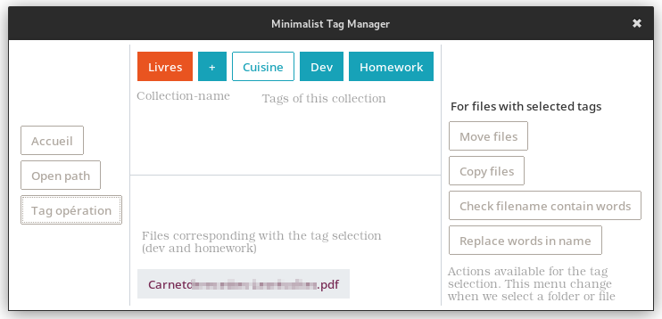

# MTM: Minimalist Tag Manager

A little python3 project to organize file with tags 🏷️

- 🪆 CLI and GUI (Tk) interface
- 📑 Tags are groupped into collection: a way to distinct movies, pictures, work...
- 🔎 Search files corresponding to one or many tags
- 🪢 Interactive mode for File Explorer integration (Gnome Nautilus scripts)
- 🗂️ Folder operations: assign all files to a tag, search untagged files, assign tag when filename contains a word...
- 📦 Tag operations: copy or moves all files with specific files to another folder, check name contains a word... Works only for one tag.
- 🚲 Minimal dependencies: all python build-in except ttkbootstrap for GUI style, no dependency for CLI tool.
- 🐧 Developped on Linux (maybe compatible with Windows/Mac)




Some use cases:
- 📚 Ebooks: tag ebooks with "read", "not read", "to read again"
- 📷 Movies/pictures: add multiples tags for an accurate selection: "Family" & "Holidays" & "Brussels", "Comedy" & "VO"
- 💼 Work: set a workflow step for any document (PDF, odt...) with tags like "To review", "To fix", "To send" ... 
- 🖇️ See documents from different folders in a unique window


## Getting Started

### Prerequisites

The requirements are only required for Graphical interface, if you use only command-line interface, theses step are not required.

```
python3 -m pip venv my-venv
. my-venv/bin/activate
pip install ttkbootstrap
```

### Usage

To create a tag "to_read" and assign it to file "test_ebook.epub":

```
./mtm.py create tag to_read
./mtm.py set file test_ebook.epub tag to_read
```

To show all commands:

```
./mtm.py help
```

Data are stored into a `tag_manager.db` SQlite file inside the folder of `mtm.py`. You can set your own database-file path with the environment variable `MTM_DATABASE`:

```
export MTM_DATABASE="/home/my-user/.data/mtm.db"
```

## Contributing

If you fork this project, open Issue, so I could reference your project as alternative inside this Readme.


## License

This project is licensed under the GPLv3 License - see the [license description on GNU website](https://www.gnu.org/licenses/gpl-3.0.en.html) for details


### About

- This project was developped as a fast proof-of-concept.
- A lot of things are perfectible, because a lot of feature where added along the time, a refactoring is welcome
- I hope to re-write this project in Golang or Rust to be portable on more OS and be more integrated with the file manager.

### Alternatives

- [tagfile](https://pypi.org/project/tagfile/): a more advanced python project, CLI only, with some dependencies